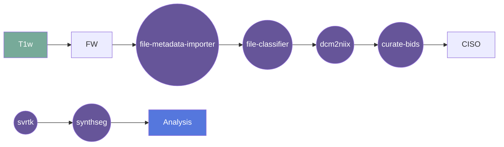

# SVRTK

**UNDER DEVELOPMENT**

Wrapper for Flywheel gear: slice to volume reconstruction toolkit 

Source:
https://github.com/SVRTK/SVRTK

## Overview

[Usage](#usage)

[FAQ](#faq)

### Summary

### Cite

**license:**

**url:** <https://gitlab.com/flywheel-io/flywheel-apps/>

**cite:**  
Uus, A., Grigorescu, I., van Poppel, M., Steinweg, J. K., Roberts, T., Rutherford, M., Hajnal, J., Lloyd, D., Pushparajah, K. & Deprez, M. (2022) Automated 3D reconstruction of the fetal thorax in the standard atlas space from motion-corrupted MRI stacks for 21-36 weeks GA range. Medical Image Analysis, 80 (August 2022).: https://doi.org/10.1016/j.media.2022.102484

Kuklisova-Murgasova, M., Quaghebeur, G., Rutherford, M. A., Hajnal, J. V., & Schnabel, J. A. (2012). Reconstruction of fetal brain MRI with intensity matching and complete outlier removal. Medical Image Analysis, 16(8), 1550–1564.: https://doi.org/10.1016/j.media.2012.07.004

### Classification

*Category:* analysis

*Gear Level:*

* [ ] Project
* [x] Subject
* [x] Session
* [ ] Acquisition
* [ ] Analysis

----

### Inputs

* api-key
  * **Name**: api-key
  * **Type**: object
  * **Optional**: true
  * **Classification**: api-key
  * **Description**: Flywheel API key.

### Config

* debug
  * **Name**: debug
  * **Type**: boolean
  * **Description**: Log debug messages
  * **Default**: false

* input
  * **Base**: file
  * **Description**: input file 
  * **Optional**: false

### Outputs
* output
  * **Base**: file
  * **Description**: file 
  * **Optional**: false

#### Metadata

No metadata currently created by this gear

### Pre-requisites

- Three dimensional structural image

#### Prerequisite Gear Runs

This gear runs on BIDS-organized data. To have your data BIDS-ified, it is recommended
that you run, in the following order:

1. ***dcm2niix***
    * Level: Any
2. ***file-metadata-importer***
    * Level: Any
3. ***file-classifier***
    * Level: Any

#### Prerequisite

## Usage

This section provides a more detailed description of the gear, including not just WHAT
it does, but HOW it works in flywheel

### Description

This gear is run at either the `Subject` or the `Session` level. It downloads the data
for that subject/session into the `/flwyhweel/v0/work/bids` folder and then runs the
`synthseg` pipeline on it.

After the pipeline is run, the output folder is zipped and saved into the analysis
container.

#### File Specifications

This section contains specifications on any input files that the gear may need

### Workflow

A picture and description of the workflow

Description of workflow

1. Upload data to container
2. Prepare data by running the following gears:
   1. file metadata importer
   2. file classifier
   3. dcm2niix
   4. MRIQC (optional)
   5. curate bids
3. Select either a subject or a session.
4. Run the svrtk-brain-reconstruction gear
5. Gear places output in Analysis

### Use Cases

## FAQ

[FAQ.md](FAQ.md)

## Contributing

[For more information about how to get started contributing to that gear,
checkout [CONTRIBUTING.md](CONTRIBUTING.md).]
